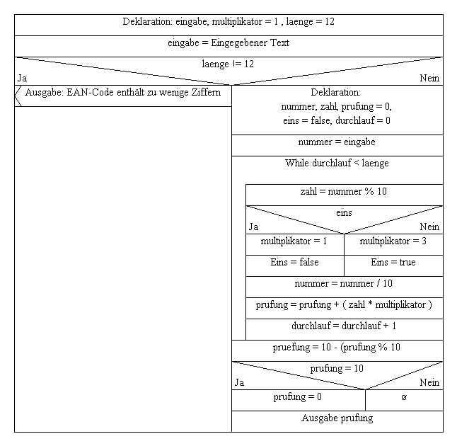

# Schreibtischtest

Ein Schreibtischtest ist ein Verfahren für das **Berechnen** eines
Algorithmus.

## Beschreibung

In der Software-Entwicklung bekommt man des öfteren verschiedene
Programmier-Abläufe zu sehen. Diese Programmier-Abläufe haben meistens
einen komplizierten Algorithmus. Anhand von Programmiercode oder eines
[Struktogramm](./../Diagramme/Struktogramm) wird nun ein **Schreibtischtest** durch geführt. Hierbei
wird nun Schriftlich festgehalten was bei jeder Zeile als Ergebnis raus
kommt.

Bei mehreren Schleifen und Abfragen kann dies, sehr kompliziert werden.
Dadruch kann logischerweiße der Schreibtischtest lange dauern, denn man
muss mehr Code berechnen und ausführlich Dokumentieren.

## Beispiel

Anhand dieser Vorlage führen wir nun ein Schreibtischtest durch.

Eingabe EAN Nummer: 123456789000\
Ergebnis: 5

------------------------------------------------------------------------

Durchlauf 1: 1\*1 +\
Durchlauf 2: 2\*3 +\
Durchlauf 3: 3\*1 +\
Durchlauf 4: 4\*3 +\
Durchlauf 5: 5\*1 +\
Durchlauf 6: 6\*3 +\
Durchlauf 7: 7\*1 +\
Durchlauf 8: 8\*3 +\
Durchlauf 9: 9\*1 +\
Durchlauf 10: 0\*3 +\
Durchlauf 11: 0\*1 +\
Durchlauf 12: 0\*3 +\
Ergebnis: 85\
85 + 5 = 90 ⇒ Prüfziffer: 8

  [Struktogramm]: Struktogramm "wikilink"
  [1]: Struktogramm-ean-pruefnummer-berechnen.png
    "Struktogramm-ean-pruefnummer-berechnen.png"
