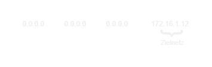

## Definition

Der Prozess zum Weiterleiten eines IP-Datagramms auf der Grundlage der Ziel-IP-Adresse wird als Routing bezeichnet.
Dieser Prozess erfolgt auf dem Sendehost und auf Routern (Layer 3)

## Warum werden Router eingesetzt?

- **Große Netze** → Teilnetze unterteilt → werden über Netzadresse (Sammeladresse) angesprochen
- **Große Netzte** → Maschentopologie → mehrere Wege zu einem Ziel /, Routingprozess → “bester Weg”
- **Router teilen Netze** in Boradcastdomänen ein
- Router → Filterfunktion → z.B. Access Control Lists (ACLs) → Zugang zu Teilnetzen wird reglementiert, höhere Sicherheit

## Routing Entscheidungsprozess

→ Wegewahl anhand einer Routing-Tabelle

→ Routing Tabelle → nur der Weg zum nächsten Zielknoten! nicht der Komplette Weg zum Ziel

→ Arten von Routen

- direct Connected
- static → händischer Eintrag
- dynamic → mit Routing-Protokoll (automatischer Eintrag)
- default → Falls der Router keinen Eintrag für das Zielnetz hat, so wird das Paket per Default an das Zielnetz weitergeleitet.

### Default Route:

## Prozess der Routenbestimmung

1. Router erhält ein Paket auf einem Interface
2. Scanne die Layer 3 Adresse des Pakets
3. Durchsuche die Routing Tabelle auf den besten übereinstimmenden Eintrag (best match)
4. Sende Paket anhand des aufgefundenen Eintrags in der Routing Tabelle an das entsprechende Interface

### Beispiel:

## Administrative Distanz (0…255)

- Ganzzahliges Maß für die Güte einer Route
- Je größer Metrik, umso schlechter die Route
- Bsp.

    | Quelle | Default |
    | --- | --- |
    | connected | 0 ← “beste” Route |
    | static | 1 |
    | OSPF | 110 |
    | RIP | 120 |
- Ziel: Werden verschiedene Routing-Protokolle eingesetzt, kann es vorkommen, dass verschiedene Wege zum selben Ziel führen Mit AD wird festgelegt, welches Protokoll gewinnt. (Route zum Ziel)

## Metrik

- Bester Weg mittels Protokoll eigener Metrik
- RIP → Hop Count
- Kosten pro Interface (Aufsummieren der Einzelkosten über den gesamten Pfad)
    - Throughput
    - Delay
    - Reliability
    - Communication Cost
